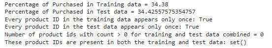

# <p align=center>`Marketing Insights Target Cosmetics`</p>

`Motivation`: Find patterns between customer purchasing behaviours from timestamped data regarding product viewing/carting/purchasing. This work is motivated by the publication https://arxiv.org/pdf/2010.02503.pdf.
The intention is to utilize as minimum product level as possible (price and product category only) at first and then design a more complex system that ingests more product level information.

`Data Description`:

`Modules`
```python
import os
import numpy as np
import pandas as pd
from sklearn.preprocessing import StandardScaler
from sklearn.decomposition import PCA
import seaborn as sb
``` 

`Tasks`: 
* Perform Exploratory Data Analysis (EDA) and Data Preparation 
#### Find the percentage of Purchased events in train and test data
```python
y_train = Past['Purchased?'].values
print(f"Percentage of Purchased in Training data = {(np.sum(y_train)/len(y_train))*100}")
y_test = Next['Purchased?'].values
print(f"Percentage of Purchased in Test data = {(np.sum(y_test)/len(y_test))*100}")
```
#### Find any overlaps in product ID between train and test data
```python
# Verify that every product ID in the training data appears only once
print(f"Every product ID in the training data appears only once: {len(np.unique(Past['product_id'])) == Past.shape[0]}")

# Verify that every product ID in the test data appears only once
print(f"Every product ID in the test data appears only once: {len(np.unique(Next['product_id'])) == Next.shape[0]}")

# Concatenate the product_id columns of the training and test DataFrames
frames = [Past.iloc[:,0], Next.iloc[:,0]]
result = np.array(pd.concat(frames))

# Get all the unique product IDs and their counts
prod, prod_counts = np.unique(result, return_counts=True)

# Determine whether any product IDs appear in both the training and test data
num = (prod_counts > 1).astype(int)
overlap = set(Past['product_id']).intersection(set(Next['product_id']))
print(f"Number of product ids with count > 0 for training and test data combined = {sum(num)}")
print(f"These product IDs are present in both the training and test data: {overlap}")
```
</img>


#### Create X_train, y_train, X_test, and y_test. 
```python
def return_train_test_data(df_old, df_new):
    X_train = df_old[['maxPrice', 'minPrice', 'Category']].values
    y_train = df_old[['Purchased?']].values
    X_test  = df_new[['maxPrice', 'minPrice', 'Category']].values
    y_test  = df_new[['Purchased?']].values
    return X_train, y_train, X_test, y_test
    
X_train, y_train, X_test, y_test = return_train_test_data(Past, Next)
```
#### Build the best classifier using the Past month's data that will predict if the Next month's products will be Purchased or not. 
```python
# utilize TPOT to estimate the best classifier 
# TPOT for classification
from tpot import TPOTClassifier

# Instantiate and train a TPOT auto-ML classifier
tpot = TPOTClassifier(generations=5, population_size=40, verbosity=2)
tpot.fit(X_train, y_train)

# Evaluate the classifier on the test data
# By default, the scoring function is accuracy
print(f"{tpot.score(X_test, y_test)}")
tpot.export('tpot_products_pipeline.py')
```

----------------------------------------------------------------------------------------------------------------
Method    |   Recall      |F1-score    |Accuracy    |
------------------------------------------------------------------------------
#### AutoML    | 0.6557                   | 0.7793                   | 0.8721                    |
-------------------------------------------------------------------------
#### Label Spread | 0.6446              | 0.7112                         | 0.8197                        | 
